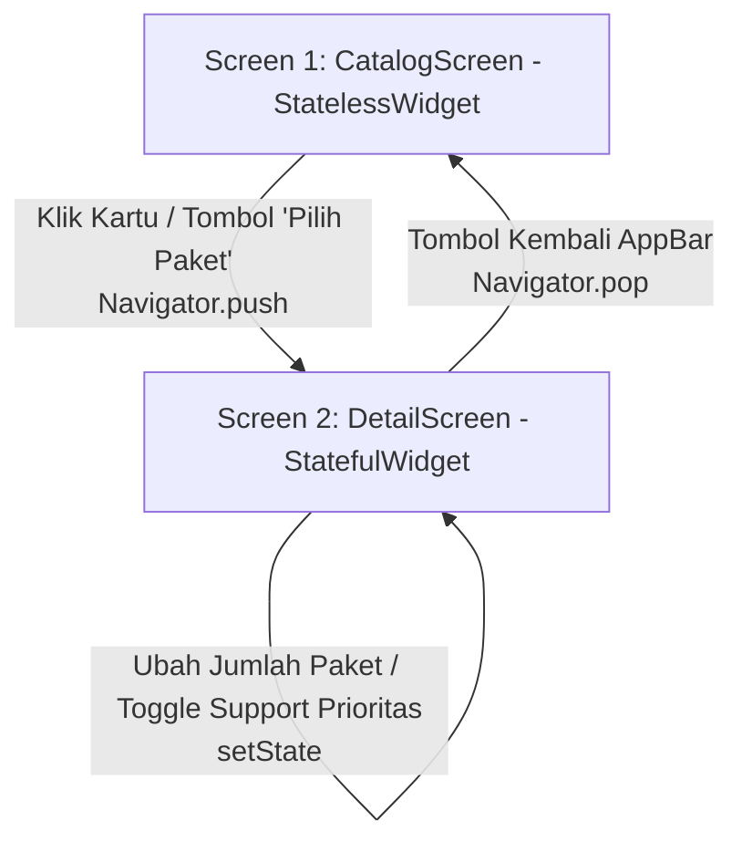

# Laporan & Dokumentasi Tugas #4 Mobile Programming (Flutter)

**Program Studi Teknologi Informasi — Kelas T3D**  
**Fakultas Ilmu Komputer, Universitas Brawijaya**

---

## 👤 Identitas Mahasiswa

| Field | Keterangan |
| :--- | :--- |
| **Nama Lengkap** | Diego Armando Ramadhan |
| **NIM** | 253140701111062 |
| **Kelas** | T3D |
| **Mata Kuliah** | Pemrograman Mobile (Mobile Developer) |
| **Topik Modul** | Tugas #4: Routing, Stack Navigation & State Management Dasar |

---

## 🎯 Ringkasan Pemenuhan Scope of Work

| No | Spesifikasi Modul Tugas #4 | Status | Implementasi pada Kode |
| :-: | :--- | :-: | :--- |
| **1** | **Screen 1 (Beranda / Katalog)** wajib `StatelessWidget` | ✅ Terpenuhi | `CatalogScreen` bertindak sebagai `StatelessWidget` murni dengan `ListView.builder` merender 3 `PricingCard` (identik desain Tugas 3). |
| **2** | **Navigasi Stack (`Navigator.push`)** | ✅ Terpenuhi | Navigasi saat item/tombol katalog diklik memanggil `Navigator.push` dengan transisi `MaterialPageRoute`. |
| **3** | **Screen 2 (Detail Katalog)** wajib `StatefulWidget` | ✅ Terpenuhi | `DetailScreen` merupakan `StatefulWidget` yang menampung mutasi state interaktif (counter kuantitas, toggle support, total harga real-time). |
| **4** | **Tata Letak Vertikal `Column`** pada Screen 2 | ✅ Terpenuhi | Seluruh elemen detail (header, harga, deskripsi, checklist fitur, stepper, tombol aksi) tersusun rapi menggunakan `Column`. |
| **5** | **Warna Pastel & Padding** untuk Deskripsi | ✅ Terpenuhi | `Container` bertema pastel hijau mint lembut (`#E8F5E9` & border `#C8E6C9`) dengan padding `16dp`. |
| **6** | **AppBar dengan Tombol Kembali Otomatis** | ✅ Terpenuhi | Menggunakan `AppBar` standar Material 3 sehingga tombol kembali (*back button*) otomatis muncul dan berfungsi via `Navigator.pop`. |

---

## 📁 Struktur Direktori & Arsitektur Proyek

```text
mobile-T3D/
├── lib/
│   ├── models/
│   │   └── package_model.dart       # Model data katalog paket layanan IT & dummy generator
│   ├── screens/
│   │   ├── catalog_screen.dart      # Screen 1: StatelessWidget (ListView 3 Pricing Cards)
│   │   └── detail_screen.dart       # Screen 2: StatefulWidget (Column + Box Pastel + Dynamic setState)
│   ├── widgets/
│   │   └── pricing_card.dart        # Komponen reusable kartu harga persis Tugas #3 (commit e8db1c5)
│   └── main.dart                    # Entry point aplikasi (MaterialApp & Theme)
├── CONTEXT.md                       # Glosarium terminologi domain arsitektur
├── SUBMISSION_TUGAS_4.md            # Laporan resmi Tugas #4 lengkap
├── pubspec.yaml                     # Konfigurasi dependensi dan SDK Flutter
└── README.md                        # Panduan instalasi dan dokumentasi teknis
```

---

## 🧭 Alur Navigasi & Diagram Interaksi



---

## 🧪 Hasil Pengujian Otomatis

### 1. Flutter Analyze (Statik Lint)
```bash
$ flutter analyze
Resolving dependencies...
Analyzing mobile-T3D...
No issues found! (ran in 1.7s)
```

### 2. Flutter Test (Widget & Navigation Flow)
```bash
$ flutter test
00:00 +0: loading test/widget_test.dart
00:00 +0: Smoke test render app, bottom navbar, and catalog
00:01 +1: All tests passed!
```

---

## 🚀 Panduan Menjalankan Aplikasi

### 1. Prasyarat
* Flutter SDK (Versi `>= 3.13.1`)
* Android Studio Emulator atau Google Chrome (Flutter Web)

### 2. Perintah Eksekusi
```bash
# 1. Unduh paket dependensi
flutter pub get

# 2. Jalankan di perangkat aktif atau Chrome
flutter run -d chrome
```

---

## 🔗 Tautan Repositori GitHub
* **URL GitHub:** [https://github.com/stanlevv/mobile-T3D](https://github.com/stanlevv/mobile-T3D)
